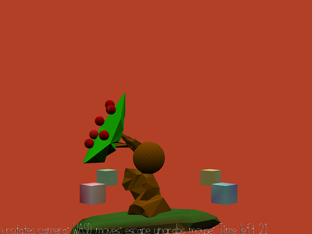

# Apples Don't Grow On Trees

Author: Ben Cagan (bcagan)

Design: Instead of controlling a character trying to get apples off a tree, what if you tried to control a tree trying to get
apples on to itself? Why? Apples may not grow on trees, but you you can make the next best thing happen by rotating the tree's
branch to correct this disaster, but watch out, there is a time limit!

Screen Shot:

How To Play:

Use WASD to rotate the trees branch up to 45 degrees in 4 directions. W,A,S,D always rotate forwards, left, back, and right, based on your camera
angle, respectively, but locked to the 4 cardinal directions. Use the mouse by dragging it left and right to rotate the camera on
the horizontal axis. Try to get 10 apples per level in the time limit, the apples will randomly appear on the blocks, and the tree
has to reach over to them to be able to grab them. After level 1, the number of apples that will appear will go down to 1, and starting
in level 3, the island the tree is on will start to rotate. Watch out, this will affect the rotation of your branch as well! After level 3
the game loops, but gets faster and faster after ever 3 levels.

Sources:

This game was built with [NEST](NEST.md).

